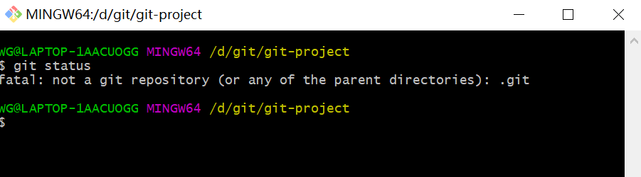
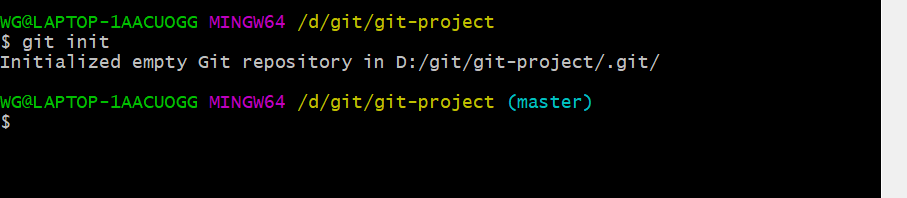
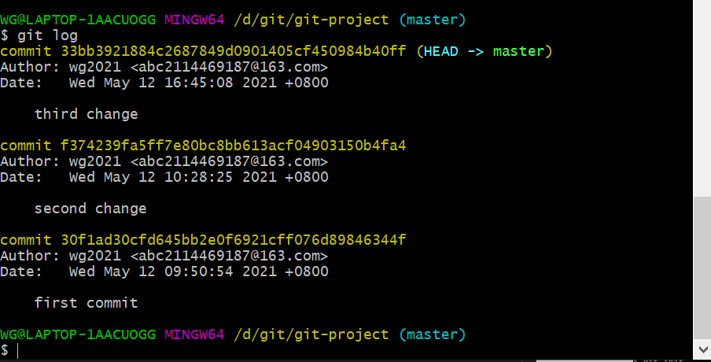
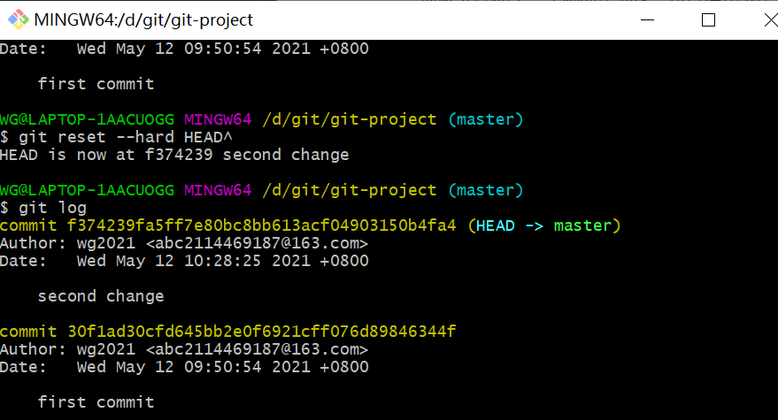
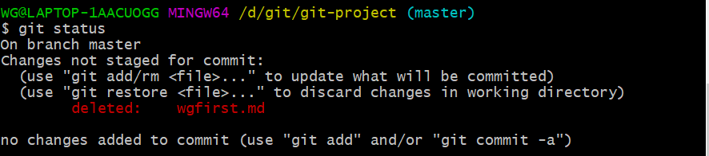
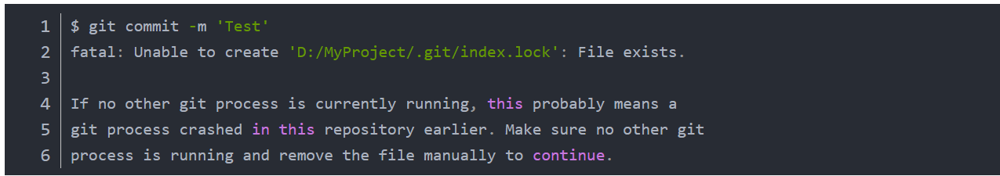
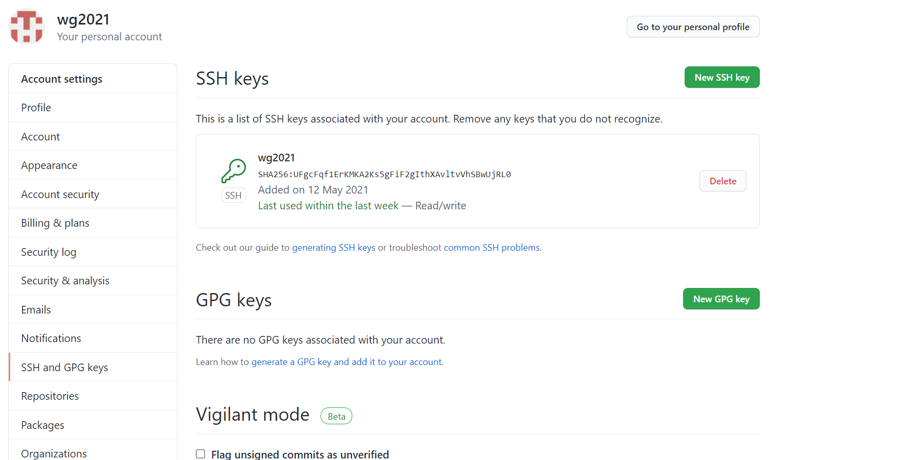
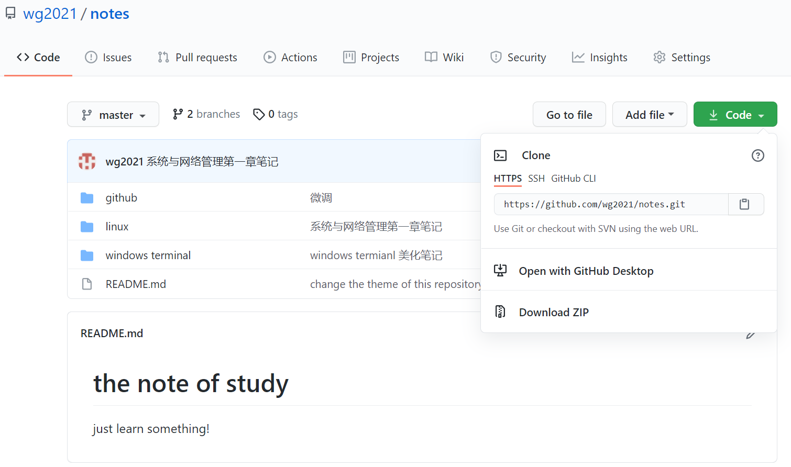

# github学习笔记

## 第一部分 认识界面

- git以及github

  Git是一个版本控制系统，而GitHub是通过Git进行版本控制的软件源代码托管服务平台

- 注册并登录

  登录这个[网址](https://github.com/)并注册

- 主界面

  首先是上方工具条，最左边是github的logo，点击就可以返回主页面，之后是搜索框，与搜索引擎用法类似，可以用来搜索资料等等。

  中间有四个按钮：
  - pull request：提交申请，参与别人的项目或者是改进别人的项目
  - issues：类似于评论功能，可以通过issues给项目提意见
  - marketplace：应用商店
  - explore：会推荐一些与自己相关话题，项目等

  接着是下方，最左边是你的项目，repository译为仓库。中间是你关注的人的动态，而右边类似于推荐页

- 个人界面

  主界面右上角是个人头像setting可以更改你的资料，your profile可以进入你的主页

  个人界面中：
  - project:项目板
  - star:点赞功能，也兼具收藏功能
  - follow:关注

- 项目界面

  通过搜索栏我们可以进入到别人的项目仓库界面

  在最上端：
  - watch：即为关注，你可以关注一个人也可以关注一个项目
  - fork：将某个仓库整个复制到自己账户下，可以加点自己的东西

  在下面的标签页：
  - code：展示代码的页面
  - issues：别人提问的页面，你可以看看是否有你遇到的问题别提问并解决
  - pull request：有人想要参与该项目，改好后可以通过pull request提交，看作者是否采纳

  在下面就是仓库里的东西了，你可以查看里面的文件夹或者文件，也可以点击clone or download下载到本地进行学习

  下滑到最下面可以看到readme.md的文字说明，主要介绍仓库的有关信息

## 第二部分仓库操作

- 创建仓库
  - 可以在个人界面创建自己的第一个仓库
  - 可以在创建时勾选添加readme文件
- 提交更改
  - 尝试更改readme文件，进入编辑模式，我们会看markdown源文件
  - 可以在preview changes里面查看预览
  - 提交更改前一定要描述对文件的更改，方便以后查看
  - 每次增删改都要提交commits
- 查看更改
  - commits反映了更改的次数，点击可以查看提交历史
- 修改名称
  - 通过setting可以修改仓库的名称
  - 通过edit可以修改仓库的描述
- 删除仓库
  - 通过setting，在页面低端可以删除仓库
  - 为了防止误删，需要验证用户名或者仓库名

## 第三部分 git安装及基本操作

- git的安装
  - Windows可以直接从官网[下载](https://git-scm.com/downloads)
  - linux系统可以通过输入`git`来查看是否安装，若是Debian系的linux可以通过命令`sudo apt-get install git`下载

- 创建版本库
  - 创建一个空目录，你可以选择在git bash里面创建，或者你可以创建一个文件夹之后右键选择git bash here
  - 通过`git status`命令可以查看仓库状态，目前我们创建的只是一个文件夹，还不算一个git仓库

  
  
  - 通过`git init`初始化仓库，并且可以看见我们已经默认进入master分支，并且当前目录下多了一个`·git`目录，不能轻易更改

  

  - 把文件添加到版本库
  - `git add <files>`命令：将文件添加到仓库，这时候文件处于一个临时缓冲区，可以使用`git rm --cached`去除这个缓存
  - `git commit`命令：将文件提交到仓库
    - `git commit -m "message"`:message部分是输入此次提交的说明
    - `git commit --amend`:追加提交，在不新增一个commit -id的情况下，将修改的代码追加到上一次的id中

- 版本回退

  随着我们的不断修改提交，就相当于游戏的存档，一旦我们误删文件之类的问题，我们可以回到某次的commit中，通过`git log`可以查看我们提交的几个版本

  

  如果我们想要回退之前的版本怎么办呢？首先需要了解在Git中用`HEAD`表示当前版本，上一个版本则是`HEAD^`,上上个就是`HEAD^^`，对于前一百个版本可以用`HEAD~100`表示。

  那么将当前版本回退到上一个版本使用`git reset --hard HEAD^`，然后我们就可以看到回到了上一个版本

  

  如果你想要回到你最新的版本，那么你也可以通过`git reset --hard <版本号前几位>`回去。查看版本号的命令是`git log --pretty=online`,如果你是之后想要会到最新版，也可以通过`git reflog`查看你的历史命令。

- 管理修改

  Git管理的是修改而不是文件，每一次修改只有先add之后才会commit。例如第一次修改后`git add`，之后紧随着第二次修改后`git commit`，commit的仅是第一次修改，第二次修改需要先add到缓冲区才能commit。具体的展开可以参考[廖雪峰教程-管理修改](https://www.liaoxuefeng.com/wiki/896043488029600/897884457270432)

- 撤销修改

  当你及时发现你犯错后，当然也有补救的措施，你可以采用一些命令应对一下几种情况

  `git checkout --<files>`:丢弃工作区的修改，可以应对两种情况，第一种是你还没有add到缓冲区，这个命令会撤销你的这次修改；第二种情况是你已经add到缓冲区再次做了修改，那么这个命令可以撤销到你add到缓冲区的状态

  但是当你不幸的发现你已经将你的错误提交到缓冲区，仍然可以挽回

  `git reset HEAD <files>`可以将暂存区的修改回退到工作区，然后就可以通过`git checkout`丢弃工作区的修改

- 删除文件

  一般删除文件我们使用`rm <files>`,这时候我们可以`git status`查看仓库状态

  

  我们发现状态提示我们删除了文件，这时候工作区和版本库就不一致了，如果想要在版本库中删除该文件，则`git rm <files>`之后再`git commit -m "remove file"`

  如果是误删，那么可以用`git checkout -- <file>`找回

- 常见命令操作
  - `git diff <files>`：查看修改前后的内容区别
  - `git log`:打印仓库提交日志，会显示作者，时间以及提交时写的信息
  - `git branch <name>`:在主分支上新建一个分支，name出填分支的名字
  - `git checkout <name>`:切换分支，后面加上分支的名字
    - `git checkout -b <name>`:新建分支后，直接切换到新分支
  - `git merge <name>`:合并命令，将分支代码合并到主分支,**注意**一定要先切换到主分支在执行合并
  - `git branch -d <name>`：对于合并的分支可以进行删除
    - `git branch -D <name>`：对于还未合并的分支，可以用此命令强行删除
  - `git tag <name>`:建立标签，例如每一个版本都设置一个标签，后续查看的时候可以使用`git checkout`切换查看
  - `git restore --staged <files>`:将缓存区的文件恢复状态（回到add之前）
    - `git restore --worktree <files>`:撤销对于文件工作区的修改

- 途中出现的小问题
  
  **报错问题**

  提交时忘了备注，当时好像进入vim编辑但是退不出去，直接关闭给git bash，导致重新启动后新的改动不能commit
  
  

  **解决方法**

  将index.lock删除之后，可以重新commit

## 第四部分 远程仓库github

- 注册github以及配置ssh
  - 创建ssh key，由于之前就已经创建过了，可以在用户目录下找到`.ssh`文件，里面由公钥和私钥
  - 在github的账户设置中`add ssh key`选项里面添加公钥

  

- 关联以及推送

  当我们在Github上创建好我们的仓库我们可以将它克隆到本地，以可以与本地的仓库关联

  ```powershell
  git remote add origin git@github.com:用户名/仓库名.git
  ```
  然后我们就可以将本地内容推送远程仓库了，由于远程仓库是空的，我们第一次推送加上`-u`的参数，Git不但会把本地的master分支内容推送到远程，还会把本地和远程的master关联起来，以后推送可以省略该参数

  ```powershell
  git push -u origin master
  ```

- ssh警告

  当你第一次使用Git的clone或者push命令连接GitHub时，会得到一个警告

  ```
  The authenticity of host 'github.com (xx.xx.xx.xx)' can't be established.
  RSA key fingerprint is xx.xx.xx.xx.xx.
  Are you sure you want to continue connecting (yes/no)?
  ```

  这是因为Git使用SSH连接，而SSH连接在第一次验证GitHub服务器的Key时，需要你确认GitHub的Key的指纹信息是否真的来自GitHub的服务器，输入yes即可.

  这个警告只会出现一次，后面操作就不会出现了

- 删除远程库

  如果关联时地址填错了，或者想删除远程库，可以使用命令删除，但是在删除之前建议使用`git remote -v`查看远程库信息
  
  然后在使用命令`git remote rm origin`删除

- 将远程库同步到本地

  有时候我们如果直接在远程库进行操作，例如直接创建一个readme文件，而我们本地库并没有该文件，这时候我们如果需要push是无法执行的，只能先进性仓库的数据同步

  ```powershell
  git pull origin master
  ```

- 克隆仓库

  如果我们需要从远程克隆一个仓库到本地

  首先我们需要先得到远程仓库的地址，如下图所示

  
  
  复制好地址后我们就可以在我们本地进行操作

  ```powershell
  git clone https://github.com/wg2021/notes.git
  ```

  我们就成功的从远程克隆了一个仓库到本地

- 远程下载

  如果我们只是需要别人仓库的单一一个文件，这时候其实就不需要fork别人仓库，然后clone到本地，我们只需要打开你需要下载的文件，然后在右上角找到**Raw**

  

  然后右键->链接另存为就可以下载到本地


## 分支

- 创建分支
  - `git checkout -b wgc`：创建并切换分支
  - `git branch wgc`：创建分支
- 切换分支
  - `git checkout wgc`：切换分支
- 查看分支
  - `git branch`：查看本地分支
  - `git branch -a`：查看远程分支
- 拉取远程分支到本地
  - `git checkout -b 远程分支名`
- 合并分支
  - `git merge wgc`
- 删除分支
  - `git branch -d wgc`

## 参考文献

- [廖雪峰git教程](https://www.liaoxuefeng.com/wiki/896043488029600/896827951938304)
- [github小白入门](https://segmentfault.com/u/yiereq1mb)
- [gith常见问题...](https://blog.csdn.net/qq_38143787/article/details/103067362)
- [狂神说java的Git教程](https://www.bilibili.com/video/BV1FE411P7B3?p=14)
  
