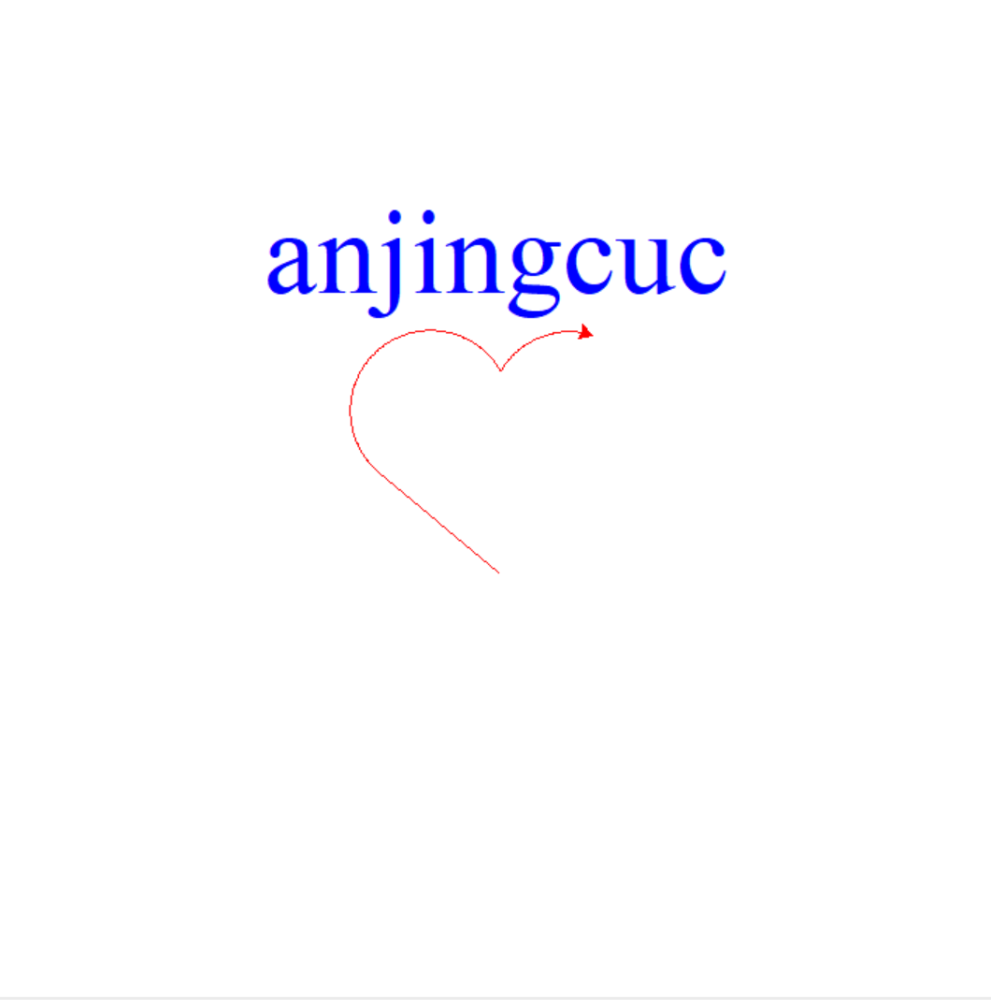
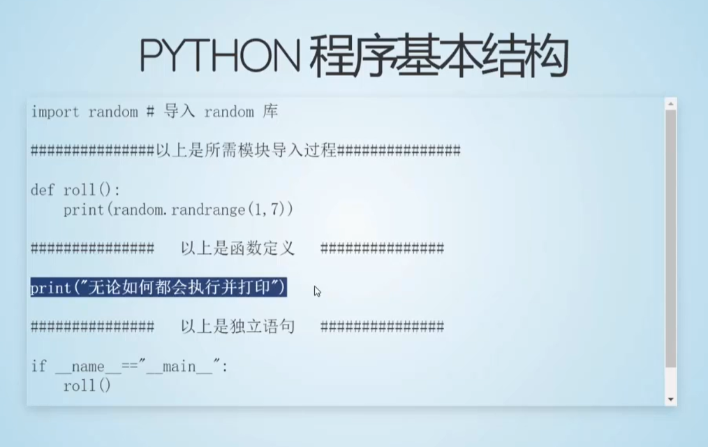
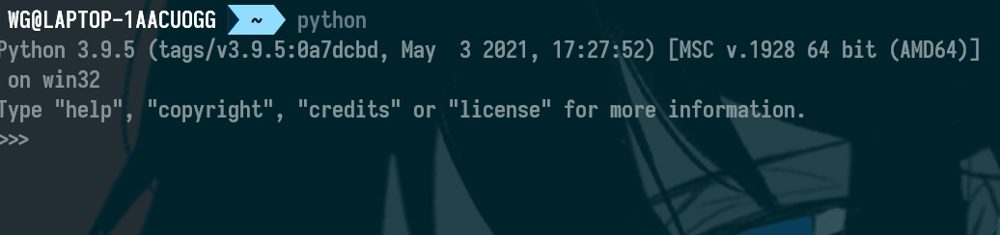
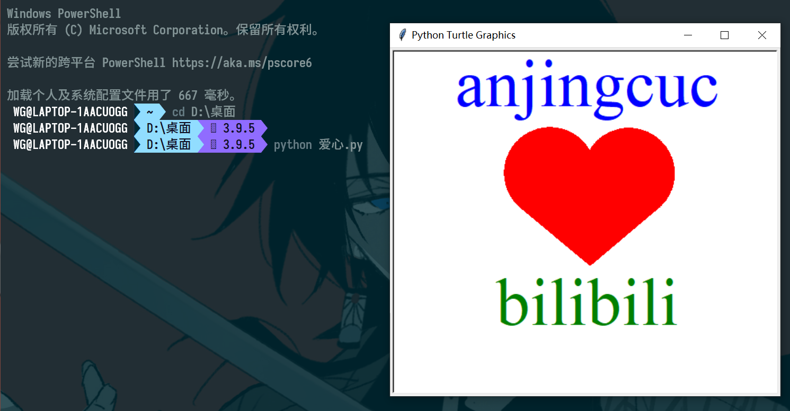
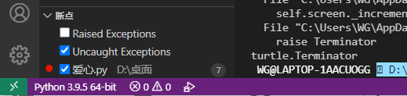
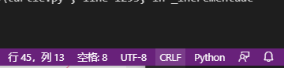

# python程序设计

## 第一章 基本概念

>## 安装

**安装**直接去官网下载最新版的python，然后默认路劲安装就好了，注意勾选添加到环境变量

安装完成后我们可以用它自带的集成开发环境IDLE上运行一下老师的小乌龟代码

>## 编译型语言和解释型语言

了解即可，后面也可以去学习《编译原理》这门课来深入了解

>## python程序的基本结构

>## 运行方式

- 交互模式

  我们可以在powershell里面直接输入python，就可以直接进入交互模式

  

  需要注意的是我们必须要将python添加到环境变量才可以

- 命令行中命令执行

  新建文件并修改后缀为`.py`，将代码写入并保存该文件，然后在命令行切换到文件所在目录输入`python xxx.py`运行，如下图所示：

  

>## vscode

安装好vscode之后要预先安装好python扩展

然后打开.py文件运行，需要注意的是vscode会提示你搜索选择python解释器，只需要点击然后找到你所安装的python版本就好了

完成后在左下角可以看到你在用的python版本

还有一个关于换行的小坑需要注意，例如从微信上复制下来的代码运行会报错，可能是因为微信自己添加了换行符或者换行不一致，可以直接把换行重新回车一遍就行

在这里windows默认的换行格式是CRLF，当然你也可以在右下角切换

