# python基础学习

## 第一章

>## python安装

安装后我们在开始菜单里面看到有如下四个

- IDLE：一个python自带的简单的开发环境
- python3.9：交互式命令行程序
- python3.9 Manuals：官方的技术文档,俗称API
- Module Docs:已安装的模块的文档

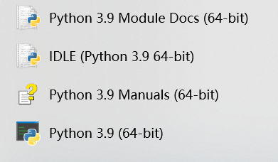

>## pycharm

- 创建第一个项目

pycharm是第三方开发环境

首先我们可以创建我们的第一个项目，如下图所示

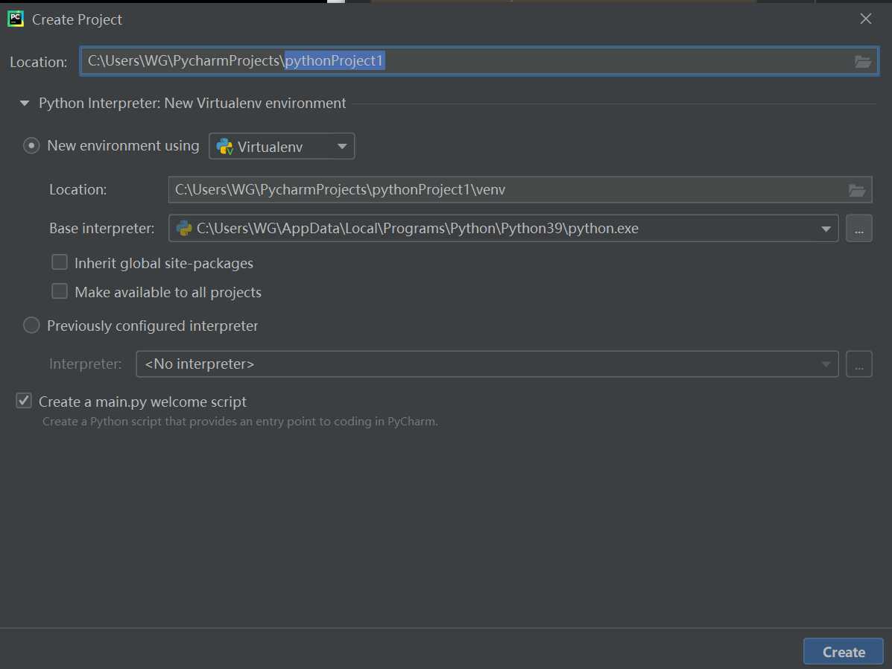

我们可以自定义创建自己的项目文件夹，然后再该文件夹下新建python项目

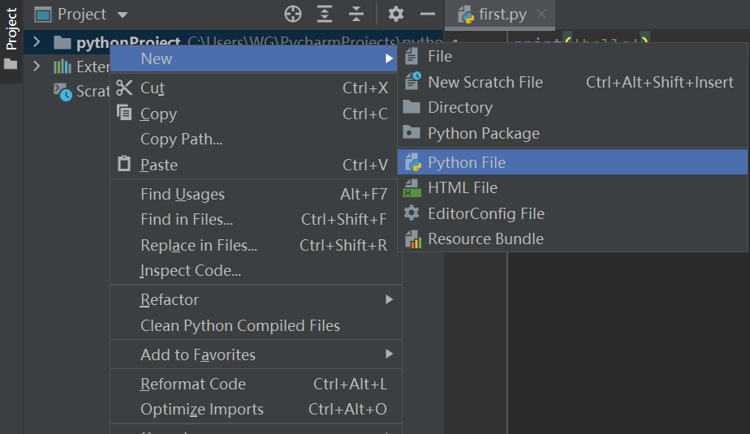

现在我们创建我们的第一个项目，我将其命名为first，然后我们使输出一个简单的单词

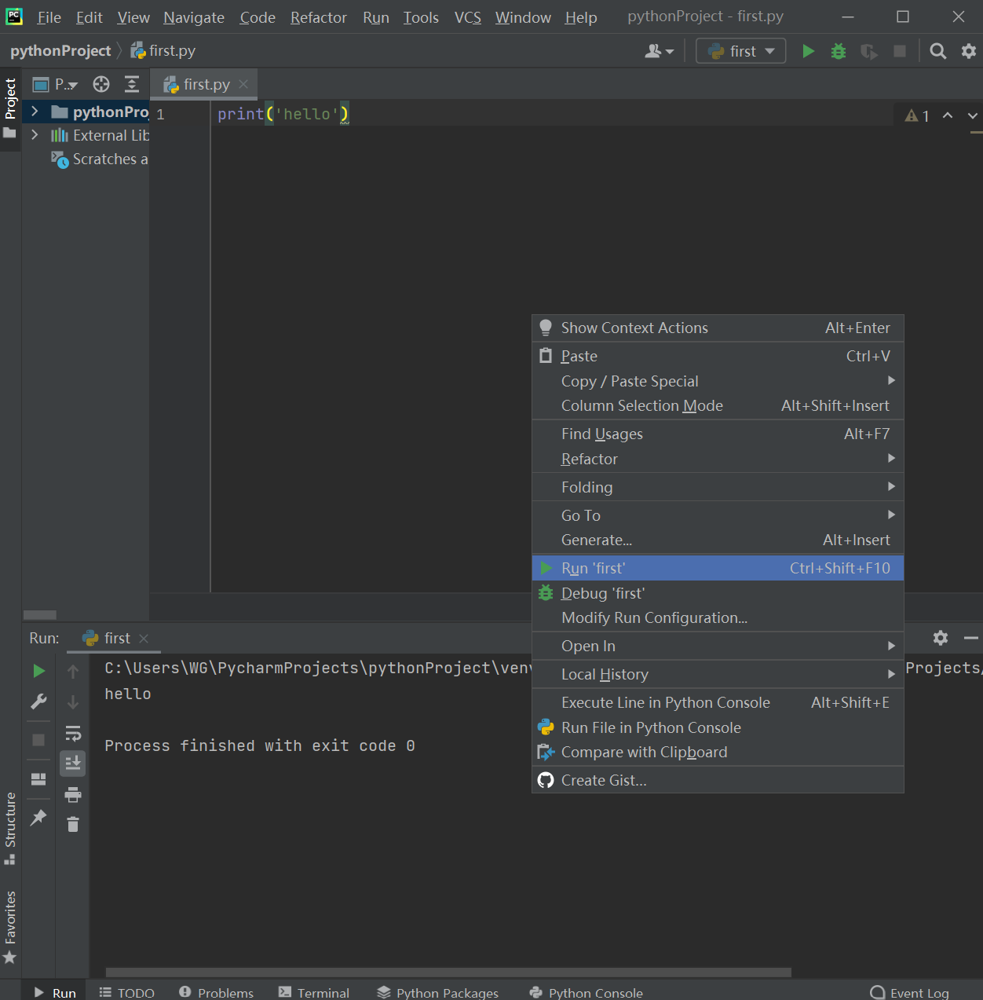

- 设置一个项目模板

首先我们选择file->settings,进入设置后我们点击file and code templates，然后在此选项页面选择Python script进行设置，如下图所示

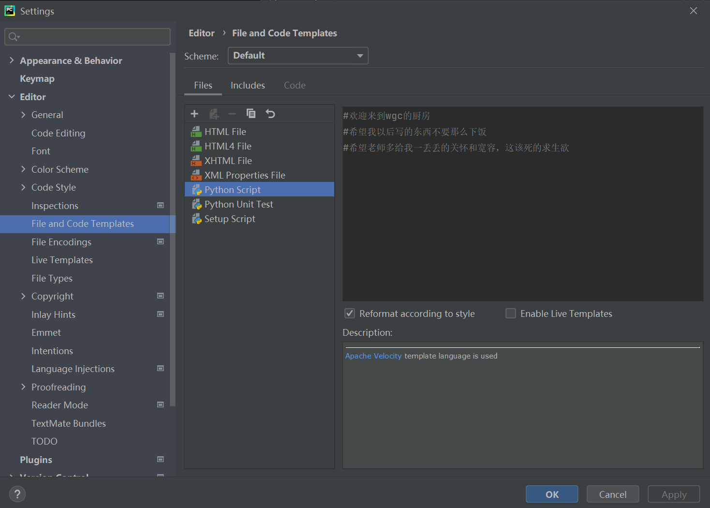

然后新建一个页面，我们就可以看到刚才的模板设置

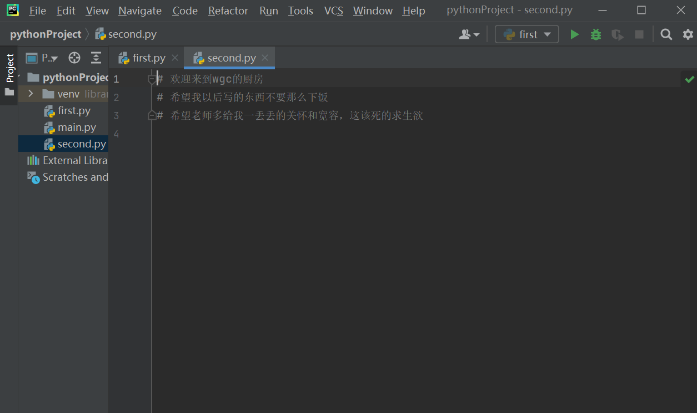

>## 输出函数print

print是一个可以直接使用的函数，可以将想要展示的东西在IDLE或者控制台上显示

- print可以输出内容
  - 数字，不加引号
  - 字符串，要加引号，单双都可
  - 含有运算的表达式，会直接输出运算结果

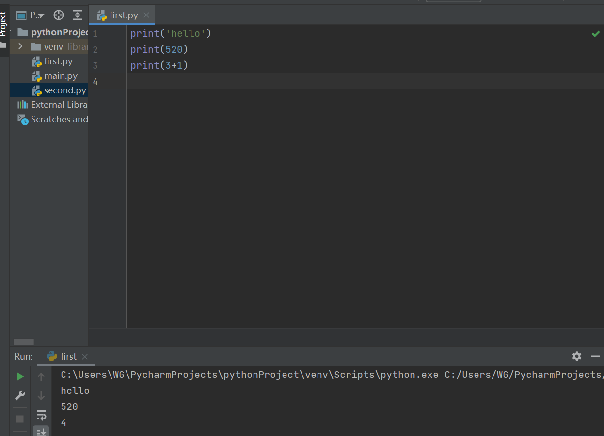

- print输出地点
  - 显示器
  - 文件

如果我们想要将输出的内容放到文件里面，可以输入以下命令

```python
# 将文件输出到桌面文件中
fp = open('D:/桌面/test.txt', 'a+')#a+表示如果文件不存在就创建，如果存在就追加
print(123, file=fp)
fp.close()
```

运行之后我们可以用git去抓取文本，看看是否输入到文本中

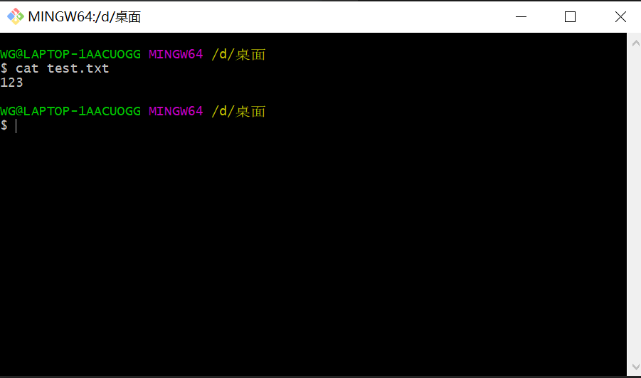

如果我们想要进行不换行输出，则执行下面的代码：

```python
print('hello','world','python')
```

>## 转义字符

转移字符表现形式：反斜杠+实现转义功能的首字母

当字符串中包含反斜杠，单引号以及双引号等有特殊用途的字符时，必须进行反斜杠对这些字符进行转义

- 反斜杠\\\
- 单引号\\'
- 双引号\\"

当字符串中包含换行，回车等无法直接表示的字符时，也可以使用转义字符来表示

- 换行\n
- 回车\r
- 水平制表符\t（一个\t占四个字符）
- 退格\b

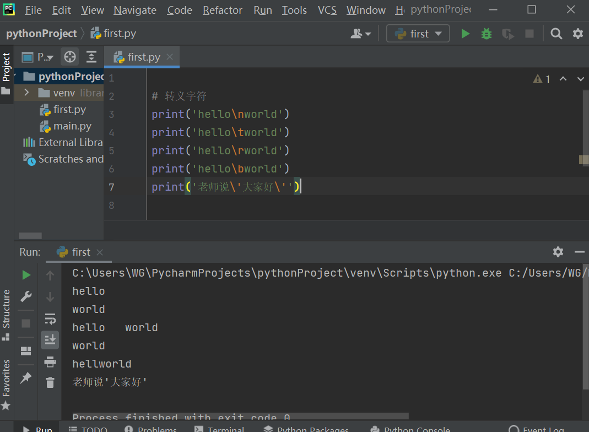

>## 原字符

如果不希望字符串中的转义字符起作用，就是用原字符，就是在字符串之前加上r或者R

但是需要注意的是，使用原字符最后一个字符不能是反斜线,可以是两个反斜杠

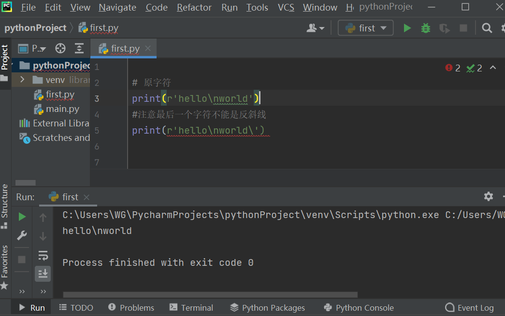

---

## 第二章

>## 二进制与字符编码

我国编码的进程：

- 二进制
- ASCII
- GB2312
- GBK
- GB18030

但是由于各个国家的不同，需要有一个统一的标准，Unicode就产生了，它几乎包含了全世界的字符

>## 标识符和保留字

保留字：一些单词被赋予了特殊的含义，在写代码时不能够随便用，例如***print***

当然我们也可以查看有哪些保留字

```python
# 查看保留字
import keyword
print(keyword.kwlist)
```

使用上述代码就可以输出需要注意的保留字

标识符：给函数，变量，模块，类以及对象起的名字就叫做标识符，他有相应的规则
  
- 可以使用字母，数字以及下划线
- 不能以数字开头
- 不能是保留字
- 严格区分大小写

>## 变量

变量是内存中一个带标签的盒子，也可以理解为可变的量

变量是由三个部分组成的

- 标识：表示对象所储存的内存地址，使用内置函数id（obj）来获取
- 类型：表示对象的数据类型，使用内置函数type（obj）来获取
- 值：表示对象所储存的具体数据，使用print（obj）可以将值打印输出

通过下图代码我们查看我们所设的变量的标识，类型以及值

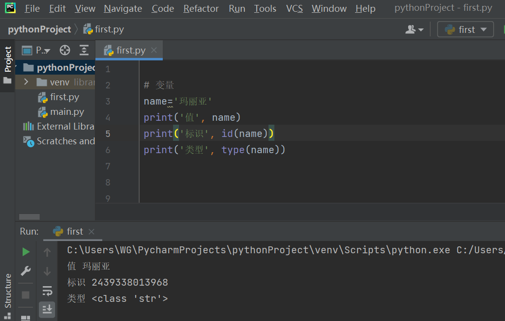

变量是可以多次赋值的，而重新被赋值的变量名会指向新的内存空间

>## 数据类型

常见的数据类型

- 整数型 int
- 浮点数类型 float
- 布尔类型 bool
- 字符串类型 str

**整数型**可以表示正数，负数以及零。并且可以表示为二进制，八进制，十进制以及十六进制

- 二进制前加**0b**
- 八进制前加**0o**
- 十六进制前加**0x**

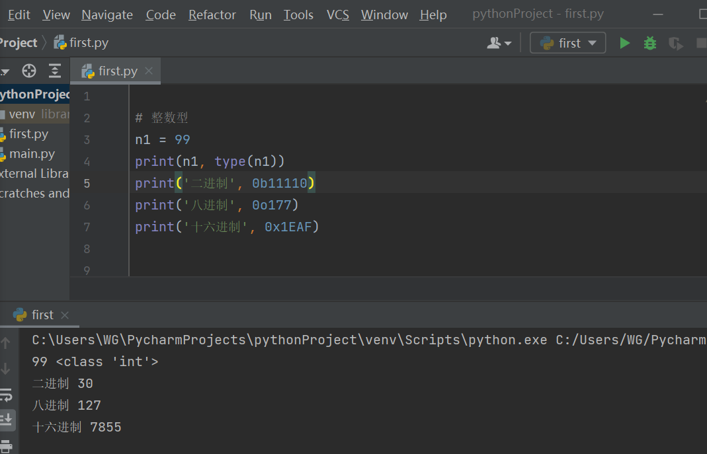

**浮点型**的浮点数是由整数部分和小数部分构成，并且浮点数存储有不精确性，在使用浮点数进行计算时，可能会出现小数位数不确定的情况

解决方法：我们可以通过导入模块decimal来解决这个问题

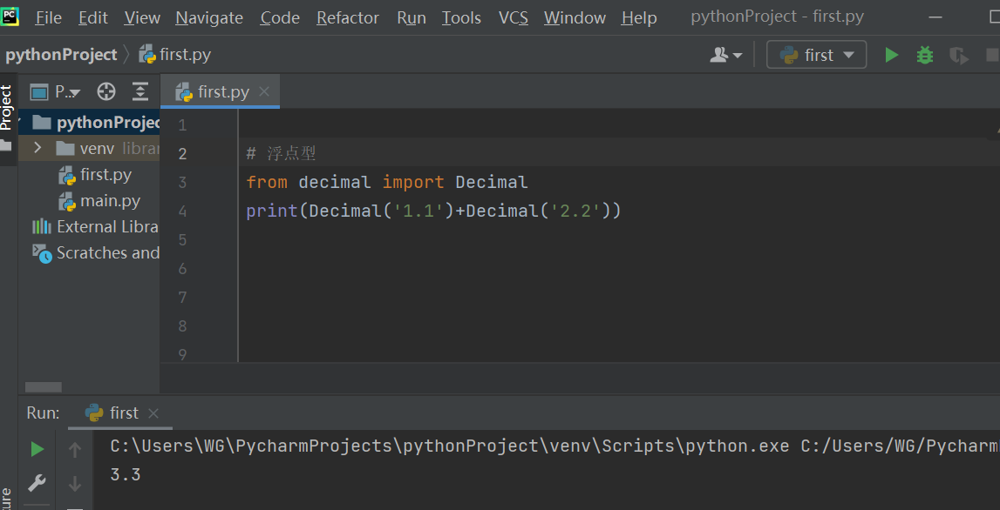

**布尔型**只有两种结果True或者Fales，并且布尔值是可以转换为整数，True表示1，False表示0

下图中为我们可以看到布尔值的转换，并且一定要注意**大小写**

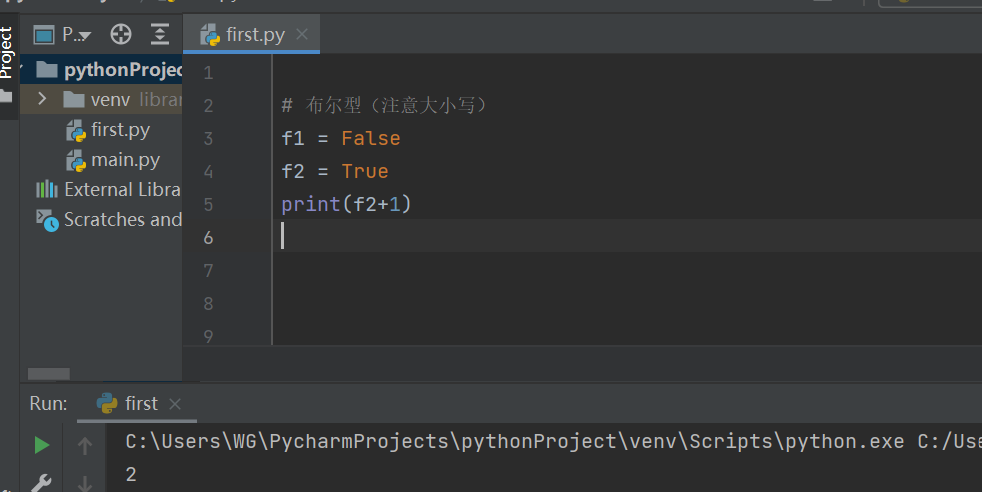

**字符串类型**字符串又被称为不可变的字符序列，可以使用单引号，双引号以及三引号来定义

不同的是单引号和双引号定义的字符串必须在一行，三引号定义的字符串可以分布在连续多行

```python
str = 'no pain no gain'
str = "no pain no gain"
str = """" no pain
no gain"""
str = '''no pain
no gain'''
```

>## 数据类型转换

数据类型转换是为了将不同数据类型的数据拼接在一起

下面是一个拼接的例子

```python
name = '张三'
age = '20'
print(type(name),tyoe(age))# 查看数据类型
print('我叫'+name+',今年'+age+'岁')# 会报错，因为两个变量的类型不一样
print('我叫'+name+',今年'+str(age)+'岁')#转换后
```

转换可以在int，float以及str三个之间发生

- 将str转换为int/float型时，字符串需为数字串，且必须为整数
- 将float转换位int型时，小数部分会被舍弃
- 将int转换问float型时，后面添加 **.0**
  
>## 注释

一般使用单行注释，以#开头

也可以使用三引号进行多行注释

其他的注释了解即可

---

## 第三章

>## 输入函数input

input函数是用来接收用户的输入，输入值的类型为str，值存储在变量中

```python
# input函数的形式
变量 = input('大圣此去，若一去不回')
```

当我们将该变量输出到显示器，我们可以在显示器上进行输入，例如

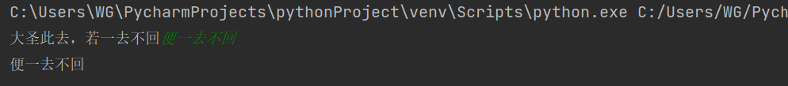

这里我们也可以做一个小的尝试来加深印象：录入两个整数，计算两者的和，代码如下

```python
# 录入两个整数，计算两者的和
a = input('请输入一个数')
a = int(a)  # 将a转化为整形，便于后面的计算
b = input('请输入另一个数')
b = int(b)  # 将b转化为整形，便于后面的计算
print(a+b)
```

结果如下图所示

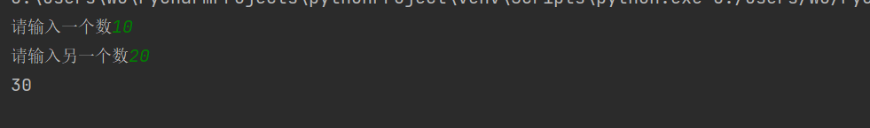

也可以简化成`a = int(input('请输入一个数'))`

>## 运算符

**算数运算符**:

- 标准运算符：加减乘除
  - //为整除
  - %为取余
  - **表示二次方
  - ***表示三次方
  - *当出现一正一负时会出现特殊情况，需要遵循一定的公式*

**赋值运算符**“=”

赋值运算是从右到左的运算

- 支持链式赋值`a=b=c=20`
- 支持参数赋值`a+=20`就相当于`a=a+20`
- 支持系列解包赋值`a,b,c=20,30,40`

同时可以进行交换赋值

```python
# 交换a，b的值
a,b = 10,20
a,b = b,a
```

**比较运算符**:

对变量或表达式的结果进行大小，真假等比较

比较运算符的结果为bool类型

```python
# 比较运算符
a,b = 10,20
print(a>b)  # 会输出false
print(a==b)  # 会输出false
print(a is b)  # 比较的是id标识是否相同
print(a is not b)  # 比较的是id标识是否不同
```

也可以进行数组的比较

```python
lst1 = [11,22,33]
lst2 = [11,22,33]
print(lst1==lst2)
```

**bool运算符**：

bool运算符是对于布尔值之间的运算

- and:全真为真，一假则假
- or：一真为真，全假为假
- not：取反
- in：在范围之中
- not in：不在范围内

```python
# bool运算符
a,b = 1,2
print(a==1 and b<2)

s = 'helloworld'
print('w' in s)
```

**位运算符**：

将数据转成二进制进行计算

- 按位与 **&**：转成二进制后对应数位都是1，取1，否则取0
- 按位或 **|**：转成二级制后对应数位都是0，取0.否则取1
- 左移位 **<<**：向左移动一位，如果高位溢出，则低位补零，并且向二进制数左移一位相当于十进制乘以2
- 右移位 **>>**：向右移动一位，如果低位截断，则高位补零，并且向二进制数右移一位相当于十进制除以2

  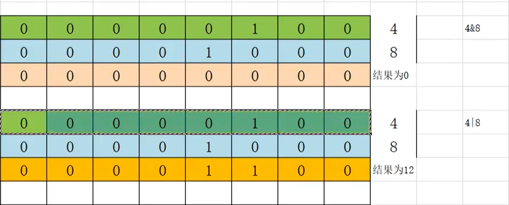

  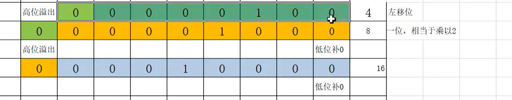

>## 运算符优先级

在运算符的优先级中，算数运算符>位运算符>比较运算符>bool运算符>赋值运算符，具体细节如下图所示：

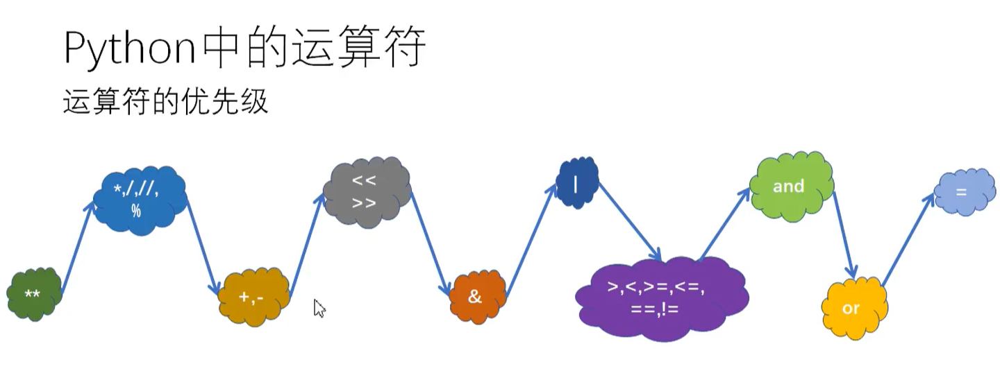

--- 

## 第四章

>## 顺序结构

一整个代码按序执行下来，中间没有跳转或者判断

>## 对象的布尔值

python中一切皆对象，所有对象都有一个布尔值，即Ture或者False，我们可以通过内置函数bool()来获取对象的布尔值

以下对象的布尔值为False

- False
- 数值0
- None
- 空字符串/空列表/空元组/空字典/空集合

>## 分支结构

**if结构**又称为单分支结构，下面写一个小例子

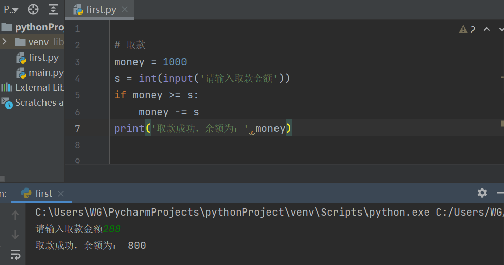

**if else结构**，又称为双分支结构

**多分支结构**：

```python
if 条件语句：
elif 条件语句：
elif 条件语句：
...
else：# else可写可不写
```

并且在python的条件语句有独特的写法，如下例

```python
# 独特的写法，只是python里面可以
if 90<=score<=100
```

**嵌套if**：

```python
if 条件语句：
    if 条件语句：
    执行体
    else：
    执行体
else：  
    执行体
```

下面做一个充会员折扣的小程序：

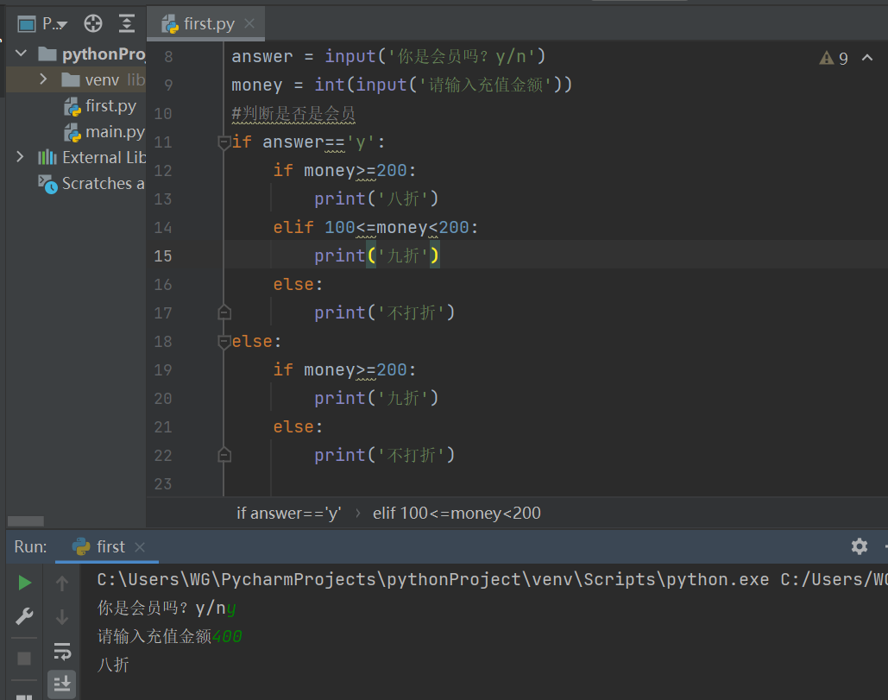

**条件表达式**就是if else的简写，可以简化操作

当if条件判断语句为true时，就执行左侧语句；否则执行右侧语句

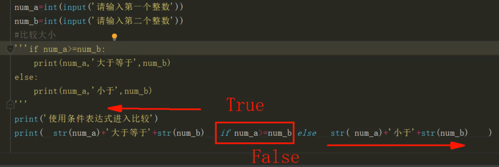

当然这里的左右侧执行语句时使用字符串连接的形式，我们也可以写成

```python
print((numa,'大于等于'，numb) if numa>=numb else (numa,'小于',numb))
```

>## pass语句

pass语句什么都不做，只是一个占位符，用到需要写语句的地方，当你还没想好怎么写的时候，可以用pass语句搭建结构

```python
if a>=100:
  pass
else:
    pass
```

---

## 第五章

