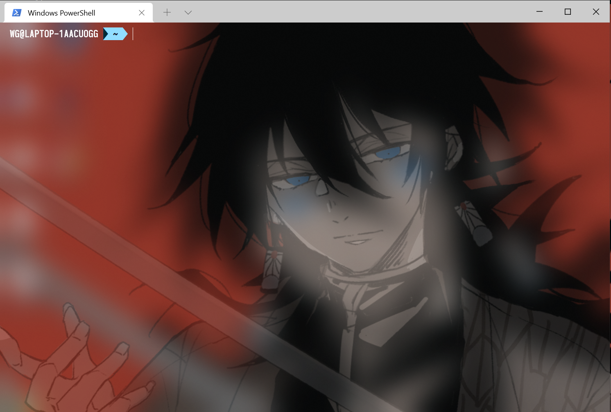
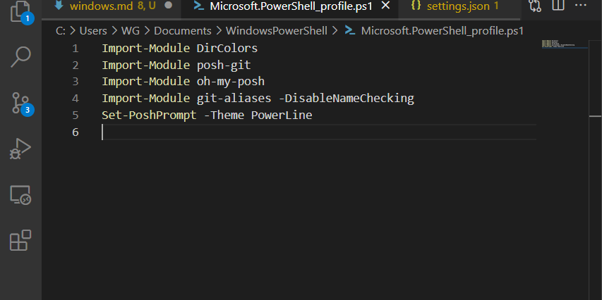

# windows terminal 美化笔记

>## 安装windows terminal

可以直接在微软商店下载安装最新版本，正常安装即可。

首先先放上我美化后的图片：



关于背景图可以去壁纸网站[wallhaven](https://wallhaven.cc/)直接下载自己喜欢的就好

>## 安装字体

下载合适的字体，之后直接安装完成，安装完成后需要在`settings.jason`文件中的`profiles`部分配置上字体，例子如下

```powershell
"profiles": {
    "defaults": {
      ...
      "fontFace": "Sarasa Term SC", //字体
      "fontSize": 14, //文字大小
      ...
    }
}
```

>## 安装模块

在安装模块前我们必须要进行权限设置，首先需要以管理员权限运行windows terminal，然后执行以下命令：

```powershell
##允许脚本执行
set-executionpolicy remotesigned
```

然后我们需要安装以下为模块：

```powershell
##安装模块
Install-Module git-aliases -AllowClobber#前两者可以实现类似oh-my-posh一样的git增强
Install-Module posh-git
Install-Module oh-my-posh #提供能10款十分漂亮的主题可供选择
Install-Module DirColors#让ls像Unix系终端一样具有多彩色

```

其中oh-my-posh提供的10款主题分别是`Agnoster`,`Avit`,`Darkblood`,`Fish`,`Honukai`,`Paradox`,`PowerLine`,`robbyrussell`,`Sorin`以及`tehrob`

之后需要加载模块以及设置主题

```powershell
Import-Module DirColors
Import-Module posh-git
Import-Module oh-my-posh
Import-Module git-aliases -DisableNameChecking
Set-Theme PowerLine
```

然后保存配置，这样就可以使其永久生效，输入`$PROFILE`命令，就可以查看配置文件的全路径，正常情况下你可以看到

```powershell
C:\Users\WG\Documents\WindowsPowerShell\Microsoft.PowerShell_profile.ps1
```

然后我们就可以用一个编辑器打开配置文件，例如`code $PROFILE`用vs code打开，然后保存以下配置



>## 主题颜色美化

主题颜色美化使用官方的`colortool`,使用的scoop包管理器下载

```powershell
scoop install colortool
```

其中`colortool`相关命令如下所示

```powershell
## - 是缩写，-- 是全称
-c --current：打印当前应用方案的颜色表
-q --quiet：使用后不要打印颜色表
-e --errors：在控制台上报告方案分析错误
-d --defaults：仅将方案应用于注册表中的默认值
-b --both：将方案同时应用于当前控制台和默认控制台。
-x --xterm：使用VT序列设置颜色。用于设置WSL中的颜色。仅适用于Windows版本>=17048。
-s --schemes：显示所有可用的方案
-l --location：显示schemes目录的完整路径
-v --version：显示版本号
-o --output<filename>：将当前颜色表输出到文件（以.ini格式）
```

使用`colortool -s`我们可以看见八种配色方案

- campbell-legacy.ini
- campbell.ini
- cmd-legacy.ini
- deuteranopia.itermcolors
- OneHalfDark.itermcolors
- OneHalfLight.itermcolors
- solarized_dark.itermcolors
- solarized_light.itermcolors

然后我们选择自己喜欢的配色即可

```powershell
colortool -b <方案>
```

当然你也可以手动配色，然后找到配色的`.json`文件，将配色复制到`schemes`里面可以。

>## 其他的windows terminal基础操作

- 分屏
  - 垂直分屏快捷键：Alt + shift + 加号
  - 水平分屏快捷键：Alt + shift + 减号
- 切屏
  - Alt + left/right/up/down
- 调节分屏窗口大小
  - Alt + shift + left/right/up/down
- 缩放当前视图
  - ctrl + 加号/减号
  - ctrl + 鼠标滚轮
- 退出分屏
  - exit